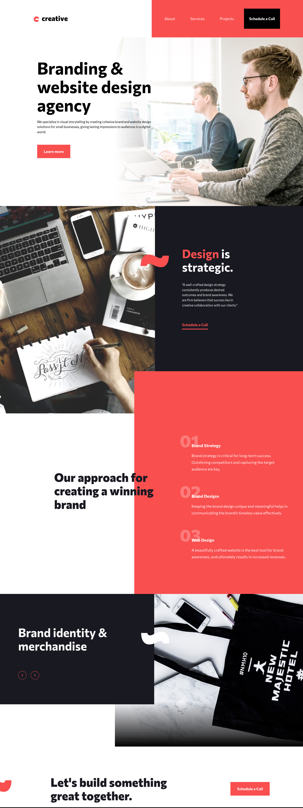

# Frontend Mentor - Creative agency single page site solution

This is a solution to the [Creative agency single page site challenge on Frontend Mentor](https://www.frontendmentor.io/challenges/creative-agency-singlepage-site-Pq6V3I2RM). Frontend Mentor challenges help you improve your coding skills by building realistic projects.

## Table of contents

- [Overview](#overview)
  - [The challenge](#the-challenge)
  - [Screenshot](#screenshot)
  - [Links](#links)
- [My process](#my-process)
  - [Built with](#built-with)
  - [What I learned](#what-i-learned)
  - [Continued development](#continued-development)
  - [Useful resources](#useful-resources)
- [Author](#author)
- [Acknowledgments](#acknowledgments)

## Overview

### The challenge

Users should be able to:

- View the optimal layout for the site depending on their device's screen size
- See hover states for all interactive elements on the page
- Navigate the slider using either their mouse/trackpad or keyboard

### Screenshot



### Links

- Solution URL: [Add solution URL here](https://github.com/ttsoares/creative_agency)
- Live Site URL: [Add live site URL here](https://creativeagency.expo.app)

## My process

### Built with

- React Native syntax
- TailwindCSS custom properties
- Animations
- SVG to React components
- Desktop-first workflow
- [React Native](https://reactnative.dev/) - JS framework.
- [Nativewind](https://www.nativewind.dev) - TailwindCSS for React Native.
- [Expo Go](https://expo.dev/) - Universal native apps with React that run on Android, iOS, and the web.

### What I learned

Expanded my understanding about how to apply animations in the context of React Native with Nativewind.

```jsx
return (
  <View className="w-full h-auto relative">
    {prevSource && (
      <Image
        source={prevSource}
        resizeMode="cover"
        className="absolute w-full h-full"
      />
    )}
    <Animated.Image
      source={source}
      resizeMode="cover"
      className="absolute w-full h-full"
      style={{ opacity: fadeAnim }}
    />
  </View>
);
```

### Continued development

Still just scratching the surface of React Native's environment. Also struggling with how to manage absolute positioning across multiple screen sizes.

### Useful resources

- [Expo Go](https://www.youtube.com/watch?v=XgWENEf3oFw&list=PLC3y8-rFHvwgVmqbtQkPDxkvDf6w5_eGA) - Frontend Made Easy.
- [Nativewind](https://www.nativewind.dev/getting-started/installation) - Documentation.

## Author

- Website - [Thomas TS](https://buildesign.vercel.app/)
- Frontend Mentor - [@ttsoares](https://www.frontendmentor.io/profile/ttsoares)
- Linkedin - [thomas-soares-6791781b/](https://www.linkedin.com/in/thomas-soares-6791781b/)

## Acknowledgments

Mentorship of different AIs like ChatGPT, DeepSeek and Windsurf.
